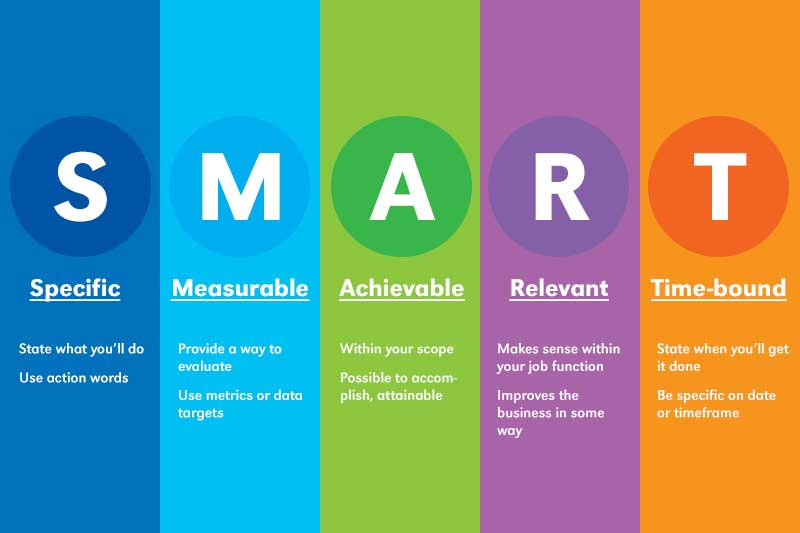

Congratulations! You are in your last year at the Institute and wondering how to distinguish between your offers which would best suit you and your goals. Keep reading to find out what you need to consider before signing an offer letter!

#Table of Contents
* [What to Keep in Mind](#keep-in-mind)
* [Researching Your City](#research)
* [Resources Mentioned in this Article](#resources)

# What to Keep in Mind

What’s the difference between an internship and a full-time career? Besides the obvious time commitment difference, you now need to be thinking of where you want to be in 5, 10, 15 years. The experience you gain from your first career out of college could be a building block to your goal of being a lead developer or it could have no impact on your journey to the top of the social pyramid. If you haven’t articulated your goals for the future, now is a good time to do so. These goals do not have to be set in stone, but having them in place will allow you to work on achieving them as you progress through your career. When forming your life goals, it’s recommended that you follow the SMART goals framework, shown above. This will allow you to phrase your goals in a way such that they are practical, which will help prevent feelings of disappointment if your goals are not met.

Another thing that employers offer to full-time employees, but don’t offer interns as frequently are benefits. These benefits are typically a 401k match and various insurance plans. It’s important to look at these in your offer package as an offer with a lower salary could potentially give you more money in the long run through their benefits. Some companies may offer a sabbatical, which is an extended period of paid leave, but under the condition that you work at the company for an extended (>5 years) time. This [informative website](https://www.goodcall.com/career/job-offer/) does a good job of breaking down some of the benefits that many jobs will offer you as a full-time employee.

Moving on to the next chapter of life is an exciting time, but it’s not something that you want to dive head-first into. Take some time to reflect and really evaluate what you want out of your career and how you can achieve that.

[**Back to Top**](#top)
# Researching Your City

When you have offers out of New York, San Francisco, Seattle, Boston, and so on, it can become a challenge to pick the location you vibe with the best when they all seem equally amazing. However, not all cities were made equal.

The biggest factor to consider when researching a city is how expensive rent is. A 1 bed/1 bath in Manhattan is going to be more expensive than a 1 bed/1 bath in Atlanta, so do your due diligence before signing a lease. A rule of thumb is that your monthly rent including all utilities should not exceed 30% of your monthly income before taxes. More often than not, living alone is more expensive than living with roommates, so if you know anyone else who also has offers in the same city you are looking at, you should reach out to them and see if they are interested in living together!

While apartment hunting, you should also keep in mind what your commute to work will look like? Does your city have spectacular and reliable public transportation? Or will it be a gamble to get to work every morning? Will you need to drive to work? Or can you walk a few blocks to get to the office? These are questions you should be asking yourself as the answer to a few of these questions will lead to more monthly expenses (vehicle, car insurance, monthly transport pass). In some states, car insurance is significantly more expensive than other states, so be sure to take note of possible rates you may have.

Another important aspect to look into is crime around the areas you might live in. If rent is suddenly very cheap in a certain neighborhood of a city, there is probably a good reason why this is the case. It may not always be crime, but it is up to you to find the reason.

Although not as critical, but just as necessary, is looking up nearby amenities and things to do in your city. If you like to go out to bars and clubs, but that scene doesn’t exist in a city you have an offer in, then you might not be as happy in that city compared to another one. Or if you enjoy hikes and nature and the beach, then a concrete jungle like Manhattan wouldn’t suit you. Just as it’s important to like what you’re doing at work, you need to enjoy what you’ll be doing outside of work for a healthy lifestyle.

A helpful resource to compare how much a salary in one city equates to another is a [cost of living calculator](https://www.nerdwallet.com/cost-of-living-calculator), which can be found online for free. These calculators will give you an estimate of rent, transportation, food, entertainment, and healthcare costs in each city to provide you a good sense of the salary you would need to make to have the same quality of life in that city.

This phase of the job hunt is either people’s favorite or their nightmare, but following these tips will make the selection process much less of a headache.

[**Back to Top**](#top)
# Resources Mentioned in this Article
* [Cost of Living Calculator](https://www.nerdwallet.com/cost-of-living-calculator)
* [Explanation of Full-time Benefits](https://www.goodcall.com/career/job-offer/)

[**Back to Top**](#top)
